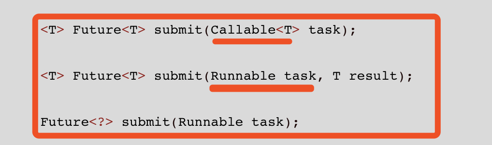
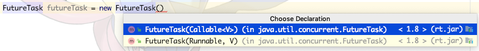

# Java多线程并发学习

参考 马士兵Java多线程高并发编程

[TOC]

## 多线程中需要考虑的两个安全问题

原子性和可见性

<font color=red>**非线程安全的问题存在于实例变量中（堆/常量池中）,如果是方法内部的私有变量存放在线程自己的方法栈局部变量中，也就不会存在线程安全问题了**</font>

原子性：保证一个资源在一个时刻只能被一个线程操作，一般就是加锁实现。

可见性：保证一个变量被一个线程修改之后，其他线程可以立即得知这个修改值，不再使用旧值。

学到的知识点：

1. 如果先判断再加锁操作，在获得锁之后要再判断一次条件
2. 加锁后的操作是保证安全的，线程一旦获得锁之后的操作按照单线程考量即可，也就说加锁之后的代码就是按照单线程代码实现
3. 没有锁的情况下调用多个原子操作也是有可能有问题的，无法保证原子操作间隙间是否有其他线程修改状态
4. 

## Capter1 Java多线程基础

#### Demo1 synchronized关键字

<font color=red>**synchronized锁定的是一个对象。可以修饰方法和代码块**</font>

1. 可以创建一个对象，锁定这个对象
2. 对于非静态类，可以锁定这个类实例对象 = 修饰<font color=red>**非静态方法**</font>
3. 修饰的静态方法 = 锁定这个类的class对象
4. 如果在静态类(只有内部静态类)，可以选择锁定外部类的对象或者内部类的class对象，静态内部类的非静态方法锁定的是外部类的对象，静态内部类的静态方法锁定的内部类的class对象。

> 静态类
>
> 1. 只能在内部类中定义静态类。
> 2. 静态类的方法可以是静态的方法也可以是非静态的方法，静态的方法可以在外层通过静态类调用，而非静态的方法必须要创建类的对象之后才能调用。
>   静态类只能引用外部类的static成员变量（变量或者方法）（也就是类变量）
> 3. 非静态类中可以包括静态成员。
>

Q：synchronized关键字锁定的是null的话会发生什么？

A：会报空指针异常，synchronized加锁其实是在对象的监视器中记录持有当前对象的线程，如果对象是null当然没有监视器变量了。

```java
Exception in thread "Thread-0" java.lang.NullPointerException
	at Capter1.NullSynchronized.m1(NullSynchronized.java:18)
	at Capter1.NullSynchronized.lambda$main$0(NullSynchronized.java:31)
	at java.lang.Thread.run(Thread.java:748)
```


#### Demo2 同步方法执行过程中，非同步方法能否运行

当然可以运行，非同步方法的运行没有什么限制。

> 补充 Java8中Lambda表达式
>
> <font color=red>**使用Lambda表达式则只需要使用一句话就可代替使用匿名类的方式，特别的能用Lambda代替的接口只有一个方法，也称为函数接口**</font>
>
> 【匿名内部类格式】 
>
> ```
> new 父类构造器（参数列表）|实现接口（）   
>    {   
>      //匿名内部类的类体部分   
>   } 
> ```
>
> 
>
> ```java
> new Thread(() -> System.out.println("Hello World!"));
> 等同于
> new Thread(new Runnable(){
>             @Override
>             public void run() {
>                 System.out.println("Hello World!"); 
>             }
>         })
> ```

#### Demo3 业务中只对写加锁，对读不加锁是否可行

主要看业务处理的要求

对用户余额进行操作，写线程对余额加锁但是并不能阻挡不加锁的读方法，在写线程还未真正写入之前，读出的余额还是之前的没有变化，第二次读时线程写入导致两次读取不一致。

类似于转账业务，在转账方显示转账成功但是实际上还没有到账，对方第一次查询是之前的数据，第二次查询就显示数据变化了。

解决方法：这里对读加锁也并不足够，这里和数据库事务还不一样，线程在两次读取中是获取锁之后是有一个释放和再获取的过程的，数据库事务是没有释放的。

#### Demo4 拥有一把锁A的线程能否调用还需要锁A的另外一个方法

如果是不同线程必然要等待锁A的释放才能调用需要锁A的另外一个方法

但是由于处在同一个线程中，synchronized支持<font color=red>**可重入锁**</font>，是可以调用不需要等待的。

##### 重入锁的的另外一种情形：子类同步方法调用父类同步方法

```java
class Demo extends Demo4 {
    public synchronized void m() {
        System.out.println("子类"+"m");
        super.m1();
    }
}

Demo demo = new Demo();
new Thread(()->demo.m()).start();
```

m方法中锁定的是子类实例对象demo

父类中<font color=red>**同步方法锁定的是this**</font>，是父类类型的子类实例对象

不管是父类还是子类锁定的都是子类实例的Demo这一个对象。

#### Demo5 synchronized方法中运行时异常，锁都会被释放，一定要处理异常

此时需要特别注意处理数据时出现异常的情况

如果处理数据时改了一半一旦出现异常，释放了锁，其他线程就会获取这个锁在一半处理一半未处理的脏数据上进行处理，将会引起数据问题。

如果线程中出现异常，一定要进行特殊处理，恢复数据保证数据安全。

<font color=red>**解决方法利用try/catch，在catch中不释放锁回滚数据。**</font>

#### Demo6 voliate和synchronized

> 补充：concurrent包下的TimeUnit类
>
> 可以根据秒、分..不同单位进行睡眠
>
> ```java
> TimeUnit.SECONDS.sleep(1);
> ```

<font color = red>**volatile关键字令一个变量在多个线程间是可见的。**</font>

volatile到底做了什么，涉及到Java对线程处理时的内存模型JMM。

> JMM模型的补充 在SummarizeGuide中

<font color=red>**volatile并不是每次读取这个值的时候都从内存读取**</font>

<font color=red>**而是在有线程修改刷回主内存时会通知其他线程缓冲区中的值已经过期需要重新读取。**</font>

Q ：如果没有volatile，线程使用的变量值一直是缓冲的固定值吗，它本身有可能从主存中刷新么？

A：线程并不是一直使用缓存中的变量，这取决于CPU的忙碌程度；如果CPU特别忙，他会一直使用缓存中的变量值；如果CPU有空闲，它是有可能从主存中刷新一下的(有可能 不可控)

Q：如何保证两个线程间的可见性

A：保证线程间的可见性，要么是volatile要么是synchronized，但是synchronized并发性比volatile差很多，能用volatile还是volatile。

#### Demo7 volatile不能代替synchronized

synchronized保证了可见性和原子性

volatile仅仅保证了可见性，他不能改变多个线程同时修改一个变量时产生的冲突问题

> volatile仅保证缓冲区的数据和主存中的数据是一致的
>
> 读取时读取的是主存中数据，但是读取之后在操作的过程中是否有其他线程对这个值进行了修改，这是volatile无法保证的。
>
> 例如：对于Num++;操作，线程1和线程2都执行一次，最后输出Num的值可能是：1或者2
> 输出结果1的解释：当线程1执行Num++;语句时，先是读入Num的值为0，倘若此时让出CPU执行权，线程2获得执行，线程2会重新从主内存中，读入Num的值还是0，然后线程2执行+1操作，最后把Num=1刷新到主内存中； 线程2执行完后，线程1由开始执行，但之前已经读取的Num的值0，所以它还是在0的基础上执行+1操作，也就是还是等于1，并刷新到主内存中。所以最终的结果是1


> 补充：Java8中的list.foreach方法
>
> ```java
> threads.forEach((o) -> o.start());
> ```

[synchronized和volatile的区别]

1. 可见性和原子性
2. synchronized的效率更低

####Demo8 Java中的原子类

 如果仅仅是处理++、—这些较为简单的操作，在Java中提供了一些原子类

AtomicXX类[AtomicInteger等等]，使用时不需要加volatile。

Q：连续调用AtomicXX类的原子方法是否有可能出现线程安全。

A：有可能会出现线程安全问题，虽然每一个原子方法都可以保证原子性，但是在每个原子方法执行的<font color=red>**间隔之间**</font>是有可能被其他线程影响的，一样会有原子性的问题。

Q：AtomicXX类的原理，是如何保证原子性和可见性的？

#### Demo9 synchronized锁如果更换了对象

synchronized锁定的是堆内存中实际实例对象上，并不是栈中引用变量上

如果锁指向的实际对象发生了改变，新的线程将以这个新的对象作为上锁的基准，旧线程已经获取了原先旧对象的锁一直未释放，依然可以运行。此时新旧线程获取的锁不同，<font color=red>**将失去同步效果**</font>。

> 
>
> 此时两个线程各自获取的已经是各自不同的锁了。

Q：如果更改一下题目，线程A运行时占有锁O，更改O对象，线程B启动后，线程A释放原有的锁，再去获取锁O时，获取的是哪一个对象的锁？？

A：只要旧线程将之前的锁释放掉了，再去获取时就需要获取当前o指向的新对象的锁，此时和新线程的锁对象是一致的。


<font color=red>**对于一个加锁对象，不要修改它的引用，声明为final**</font>

```java
final Object lock = new Object();
```

因此，<font color=red>**不要用字符串常量作为锁定的对象**</font>，因为：

1. 字符串的值一旦修改，指向的将是一个新的对象
2. 两个不同的字符串引用s1\s2指向同一个字符串常量，锁定的将是同一个对象，同一把锁；如果没有注意到这是同一把锁，很有可能引起死锁。

#### Demo10 一个面试题，实现一个容器

Q：实现一个容器，容器中有两个方法，一个add添加元素，一个size显示元素个数

要求：写两个线程，一个线程负责向容器中加元素，一个线程负责监视容器中元素个数，当元素个数为5时，线程2给出提示并退出。

Step1：为了保证容量变量在线程间是可见的，需要volatile关键字。

> 导致的问题：
>
> ```java
> /**
>  * 可以基本满足条件，但是还存在很多问题
>  * 1. 线程2一直在循环中等待，造成了CPU的浪费
>  * 2. 虽然使用了volatile关键字保证可见，但是线程2在满足条件通知的时候线程1可能又加了元素，导致通知完成后条件可能已经不满足了，通知有一定不准确
>  */
> ```

Step2：为了避免线程2在等待满足条件时一直死循环浪费资源，考虑wait/notify机制。

> 1. wait/notify机制必须通过加锁对象来实现，通过调用锁定对象的wait方法和notify对象，因此必须加锁。
> 2. wait会立刻释放锁，但是notify要等待线程执行完毕之后才会释放锁
> 3. wait/notify中为了防止wait线程没有在条件满足之前进入wait队列，<font color=red>**要求wait线程先启动。**</font>

Step3：为了解决不精确的问题，只能通过加锁来解决。

Step4：如何解决notify时想立刻释放锁，而不是等待线程完成再释放。

notify的时候再进行一次wait。


> 当然还有其他可以立即释放锁的方式，后面在看

```java
线程1：
								lock.notify(); //唤醒线程2
                    //唤醒之后需要释放这个锁，可以再调用一个wait，立即释放
                    try {
                        lock.wait();
                    } catch (InterruptedException e) {
                        e.printStackTrace();
                    }
                    
线程2：
 				 try {
                    lock.wait();
                } catch (InterruptedException e) {
                    e.printStackTrace();
                }
            }
            lock.notify();// 一定不要忘记这个notify，否则线程1会一直等待下去
```

Step5：最简单的方式是利用latch门闩的await/countDown机制代替wait/notify机制

`CountDownLatch`门闩，当值为0时表示门闩已开，另外一个线程可以运行

latch.await()用于等待，但是不需要锁定任何对象，等待latch的值为0时运行。

##### CountDownLatch


####  线程间的通信方式(两种方式)

1. 维护一个共享内存，做线程同步
2. 线程间发消息：wait/notify机制、Lock的await方法、condition的await/signal机制

## Capter 2 Lock和ThreadLocal


####Java高并发编程主要知识点

1. 同步器：synchronizer
2. 同步性容器：ConcurrentHashMap等等
3. 线程池：ThreadPool、executor


#### Demo1 Lock接口基本使用

JDK提供的一个新的锁，用来Lock.lock()和unlock()方法替换synchronized

> Lock是一个接口，常用的实现类为ReentrantLock
>
> 如果想实现自己的锁，可以选择实现Lock接口

```java
public interface Lock {

    void lock();
    
    void lockInterruptibly() throws InterruptedException;

    boolean tryLock();
   
    boolean tryLock(long time, TimeUnit unit) throws InterruptedException;
   
    void unlock();

    Condition newCondition();
}

```

##### lock()\unlock()的使用

1. 创建一个lock对象
2. 当执行一段同步代码时，代码前设置lock.lock()相当于执行了synchronized(lock)
3. 必须要注意的是<font color=red>**Lock是手工锁**</font>，不像synchronized代码执行结束或者异常等等有JVM自动释放锁,synchronized是自动释放锁，<font color=red>**lock的锁一旦lock()锁住，就必须显式unlock()解锁。**</font>一般在finally里释放锁。

```java
			 lock.lock();
        try {
            //执行同步代码
          //为了防止同步代码中有什么异常，导致锁一直占有，把同步代码写到try中
        }catch (Exception e){ 
            e.printStackTrace();
        }finally{
            lock.unlock(); 
        }
```

##### trylock()尝试锁定

lock如果得不到这把锁，可以继续执行，可以退出，可以做其他操作

synchronized如果得不到这把锁，只会一直阻塞(阻塞到死)

1. `boolean tryLock();`
   1. 如果该锁没有被另一个线程保持，并且立即返回 true 值，则将锁的保持计数设置为 1，即使已将此锁设置为公平锁，但是调用 tryLock() 仍将立即获取锁，打破公平性
   2. <font color=red>如果当前线程已经保持此锁，则将保持计数加 1，该方法将返回 true。可以根据这个方法了解当前线程是否获得了锁。 </font>
   3. 如果锁被另一个线程保持，没有拿到返回false，不阻塞
   4. 可以根据返回值分情况继续执行下面的代码；
2.  `boolean tryLock(long time, TimeUnit unit) throws InterruptedException;`指定一个时间长度和一个时间单位，表示在此等待锁阻塞固定时间，如果在固定时间内拿到锁返回true，如果超过了这个时间还没有拿到锁，返回false，剩下和上面的trylock()一直

<font color=red>**注意获取锁的话，一定要释放锁啊啊啊啊啊**</font>

```java
finally {
                if (locked)lock.unlock(); //不要忘记释放锁啊啊啊啊啊啊啊啊
            }
```

##### lockInterruptibly的使用

在lock()方法中，阻塞在等待锁的线程是无法被其他线程打断的，只能一直阻塞一直等待。

lockInterruptibly()方法的线程虽然阻塞在等待锁的过程，但是依然是可以被打断的，此时<font color=red>**可以响应其他线程对自己线程的Interrupt()打断**</font>，此时被打断时会抛出`InterruptedException`异常。

1. 如果当前线程未被中断，则获取锁
2. 如果该锁没有被另一个线程保持，则获取该锁并立即返回，将锁的保持计数设置为 1。
3. 如果当前线程已经保持此锁，则将保持计数加 1，并且该方法立即返回。
4. 如果锁被另一个线程保持，没有获得锁，线程将一直处于阻塞状态
5. 如果线程在等待锁时被其他线程Interrupt，或者在进入lockIntteruptibly方法之前就被interrupt了， 则抛出 InterruptedException，并且清除当前线程的已中断状态。
6. 在此实现中，因为此方法是一个显式中断点，所以要<font color=red>**优先考虑响应中断**</font>，而不是响应锁的普通获取或重入获取。 
7. <font color=red>**如果线程在其他线程Interrupt之前已经获得了锁，开始执行则不会再响应中断。**</font>

> 线程的中断机制，每一个线程都有Interrupt标志
>
> 1. **线程在<font color=red>sleep或wait,join</font>**， 此时如果别的进程调用此进程的 **interrupt（）方法**，此线程会被唤醒并被要求处理**InterruptedException**；(thread在做IO操作时也可能有类似行为，见java thread api)
> 2.  **此线程在运行中， 则不会收到提醒。但是 此线程的 “中断标志”会被设置， 可以通过isInterrupted()查看并作出处理。**
> 3. lockInterruptibly()和上面的第一种情况是一样的， 线程在请求lock并被阻塞时，如果被interrupt，则“此线程会被唤醒并被要求处理InterruptedException”。**并且如果线程已经被interrupt，再使用lockInterruptibly的时候，此线程也会被要求处理interruptedException**

##### ReentrantLock可以指定为公平锁

这个不是Lock接口实现方法，而是ReentrantLock类的构造器函数

默认的synchronized都是非公平锁

> 非公平锁：释放的锁被哪个线程获取是不可控制的，又叫做竞争锁，效率比较高，CPU不需要计算哪个线程的等待时间更长。
>
> 公平锁：释放的锁首先给等待时间最长的那个线程，效率较低

```java
    public ReentrantLock(boolean fair) {
        sync = fair ? new FairSync() : new NonfairSync();
    }
```

入参为true时，表示公平锁。

##### ReentrantLock和synchronized的区别

1. ReentrantLock可以完成synchronized的功能
2. ReentrantLock更灵活，可以设置阻塞时间，可以在阻塞中响应中断
3. ReentrantLock可以指定为公平锁，synchronized只能是非公平锁
4. ReenTrantLock提供了一个Condition（条件）类，用来实现分组唤醒需要唤醒的线程们，而不是像synchronized要么随机唤醒一个线程要么唤醒全部线程。
5. ReenTrantLock必须显式释放锁，synchronized则由JVM自动释放锁。

#### Demo2 生成者-消费者模式

Q：实现一个同步容器，具有 get put getCount方法，能够支持两个生成者线程和10个消费者线程调用，容器的固定容量为N(10个元素)

A：注意要求实现的是同步容器，在多个线程下不能出现问题：如果容器满了，生成者put线程必须等待；如果容器量为0，消费者get线程必须等待

实现方式：线程间发送消息，wait/notify机制；门闩latch.await机制；condition.await/signal机制

##### Object的wait/notifyAll机制

注意点：

1. <font color=red>**wait判断条件时要用while，而不是if**</font>。如果使用if，在叫醒之后如果其他线程对条件又做了改变，此时已经不满足条件但是线程依然会继续运行。
2. <font color=red>**唤醒线程用的是notifyAll而不是notify。**</font>因为生产者notify的时候是去随机叫醒一个线程，并不能保证叫醒的是哪个线程，有可能叫醒的依然是一个生产者，导致容量满了所有线程都是等待。
3. <font color=red>**wait和notify调用时必须上锁，只有上锁才能使用**</font>
4. 要对容器加锁，是保证当前只有一个线程对容器内容操作，但是并不能解决并发性的问题，依然需要while判断，是因为线程再拿到这把锁的时候并不能保证代码执行到哪个位置了。所以锁和线程代码执行位置是没有关系的，要足够考虑到线程获取锁时的代码执行位置。

##### condition的await/signalAll机制

###### condition是什么？

condition是Lock接口下的调用`Condition newCondition();`创建的，也就是说如果想使用condition的await方法一定需要一个lock对象，代表的是<font color=red>**等待这个lock对象锁释放的各个线程间的通信**</font>

<font color=red>**conditon中最大的特点是能够支持多个等待队列，可以精确指定叫醒哪些线程**</font>（也就是说一个lock对象可以new 多个Condition对象），而Object方式只能支持一个。

> 如何实现的，对于Object类我们知道每一个Object类都有自己的一个同步队列和一个等待队列，等待队列中存放在object.wait的线程，同步队列中存放着等待Object锁释放的线程。
>
> 但是并发包中Lock接口在代码角度进行了扩展，令<font color=red>**Lock对象维护了一个同步队列和多个等待队列**</font>[这多个等待队列就是对应着多个condition对象]
>
> 
>
> 

```java
// 造成当前线程在接到信号或被中断之前一直处于等待状态。
void await()
// 造成当前线程在接到信号、被中断或到达指定等待时间之前一直处于等待状态。
boolean await(long time, TimeUnit unit)
// 造成当前线程在接到信号、被中断或到达指定等待时间之前一直处于等待状态。
long awaitNanos(long nanosTimeout)
// 造成当前线程在接到信号之前一直处于等待状态。
void awaitUninterruptibly()
// 造成当前线程在接到信号、被中断或到达指定最后期限之前一直处于等待状态。
boolean awaitUntil(Date deadline)
// 唤醒一个等待线程。
void signal()
// 唤醒所有等待线程。
void signalAll()
```

###### Conditon源码分析

分析ReentrantLock下的condition对象，实际上是实现了condition接口下的ConditionObject实例对象。

每一个ConditionObject都维护了一个等待队列的两个节点开始和结尾两个节点，通过这两个节点可以维护一个FIFO队列，也就是说<font color=red>**每个condition对象都可以维护一个各自的等待队列。**</font>

```java
/** First node of condition queue. */
 private transient Node firstWaiter;
/** Last node of condition queue. */
private transient Node lastWaiter;
```


Node中存放的是线程的引用

       Node(Thread thread, Node mode) {     // Used by addWaiter
                this.nextWaiter = mode;
                this.thread = thread;
            }
       Node(Thread thread, int waitStatus) { // Used by Condition
            this.waitStatus = waitStatus;
            this.thread = thread;
        }
在调用Condition的await()方法之后，线程释放锁，创建一个包含此线程引用的节点放入此condition的等待队列中(链接到最后节点)，singnal方法就是去移除这个<font color=red>**首节点**</font>，signalAll()就是移除所有节点。

```java
 private Node addConditionWaiter() {
            Node t = lastWaiter;
            // If lastWaiter is cancelled, clean out.
            if (t != null && t.waitStatus != Node.CONDITION) {
                unlinkCancelledWaiters();
                t = lastWaiter;
            }
            Node node = new Node(Thread.currentThread(), Node.CONDITION);
            if (t == null)
                firstWaiter = node;
            else
                t.nextWaiter = node;
            lastWaiter = node;
            return node;
        }
```

<font color=red>**每一个节点都是调用await之后新创建的，因此没有节点冲突交叉的问题。也就是说一个线程可以在多个condition的等待队列中**</font>

###### condition关于本题的实现

```java
 static class Container2<T extends Object>{
        private List<T> list = new ArrayList<>();
        private int MAX_SIZE = 10;
        private int size = 0;

        private ReentrantLock lock = new ReentrantLock();
        private Condition produer = lock.newCondition();//生产者队列
        private Condition consumer = lock.newCondition();//消费者等待队列

        public void put(T t) {
            lock.lock();
            try {
                while (size == MAX_SIZE) {
                    System.out.println(Thread.currentThread().getName() + "容器已满");
                    produer.await();//加入生产者等待队列
                }
                list.add(t);
                System.out.println(Thread.currentThread().getName() + "添加" + t);
                size++;
                consumer.signalAll();//通知消费者等待队列醒来
            }catch (Exception e) {
                e.printStackTrace();
            }finally {
                lock.unlock();
            }
        }

        public T get() {
            lock.lock();
            T t = null;
            try {
                while (size == 0) {
                 //   System.out.println(Thread.currentThread().getName() + "容器已空");
                    consumer.await();
                }
                t = list.get(size-1);
                list.remove(size-1);
                size--;
                System.out.println(Thread.currentThread().getName() + "获取" + t);
                produer.signalAll();
            }catch (Exception e) {
                e.printStackTrace();
            }finally {
                lock.unlock();
            }
            return t;
        }

    }
```

#### Demo3 ThreadLocal

线程局部变量 ThreadLocal，<font color=red>**为每一个线程提供了一个独立的变量副本，隔离了多个线程对数据的访问冲突**</font>。因为每一个线程都拥有自己的变量副本，从而也就<font color=red>**没有必要对该变量进行同步了**</font>

<table><tr><td bgcolor=yellow>1. ThreadLocal 并不是为了解决线程安全问题，而是提供了一种将实例绑定到当前线程的机制，类似于隔离的效果，实际上自己在方法中 new 出来变量也能达到类似的效果。但是比new效率更高一点</td></tr>
  <tr><td bgcolor=yellow>2. ThreadLocal类不必加锁，因为是隔离的</td></tr></table>

ThreadLocal提供了线程安全的共享对象，在编写多线程代码时，可以把不安全的变量封装进ThreadLocal，<font color=red>**对于ThreadLocal中的变量，线程间不会互相影响，也就不会互相通信了**</font>

##### 实现原理

1. Thread为每一个线程实例存放了一个threadLocals的成员变量，维护ThreadLocalMap结构。

```java
 /* ThreadLocal values pertaining to this thread. This map is maintained
     * by the ThreadLocal class. */
    ThreadLocal.ThreadLocalMap threadLocals = null;
```

2. ThreadLocalMap是ThreadLocal中的一个静态内部类，它维护了一个Entry<ThreadLocal,Object>的键值对数组，<font color =red >数组存放的下标时基于ThreadLocal对象的hashcode存放的。</font>
3. 由此我们知道一个ThreadLoadl对象绑定一个Object变量，在一个线程Thread中会有一个维护多个ThreadLocal实例的数组，这个数组叫做ThreadLocalMap


4. threadlocal实例的get做了什么
   1. <font color=red>**ThreadLocalMap中数组的下标是基于threadlocal对象的hashcode存放的，这一点一定要记住。**</font>
   2. 获取当前线程下维护的threadlocalmap
   3. 根据ThreadLocalmap的hashcode获取下标，获取值

```java
public T get() {
    Thread t = Thread.currentThread();
    ThreadLocalMap map = getMap(t); //这里就是返回t.threadlocals
    // 1 获取当前线程下的threadlocals实例对象
    if (map != null) {
        ThreadLocalMap.Entry e = map.getEntry(this);
        if (e != null) {
            @SuppressWarnings("unchecked")
            T result = (T)e.value;
            return result;
        }
    }
    return setInitialValue();
}

private Entry getEntry(ThreadLocal<?> key) {
    // 2 根据threadLocal的hashcode获取维护的数组下标
    int i = key.threadLocalHashCode & (table.length - 1);
    Entry e = table[i];
    // 3 该下标存放了一个Entry<threadLocal,value>获取到这个value
    if (e != null && e.get() == key)
        return e;
    else
        return getEntryAfterMiss(key, i, e);
}

//说明hash冲突了，从hash开始遍历查找后面是否有这个key
private Entry getEntryAfterMiss(ThreadLocal<?> key, int i, Entry e) {
            Entry[] tab = table;
            int len = tab.length;

            while (e != null) {
                ThreadLocal<?> k = e.get();
                if (k == key)
                    return e;
                if (k == null)
                    expungeStaleEntry(i);
                else
                    i = nextIndex(i, len);
                e = tab[i];
            }
            return null;
        }
```

5. ThreadLocal的set做了什么

   1. 将要set进的对象放入线程中维护的Threadlocalmaps中

   2. Q：要set的对象只是对象引用，如果修改了堆中的对象，不一样会改变线程值吗？？A：调用set方法时需要放置一个Object对象，在ThreadLocal中没有公共内存的概念，放置的这个Object对象是我这个线程自己创建的私有对象，只是引用在全局变量而不是栈上，每个线程set的都是不同的新对象，因此不会冲突。

      

```java
 private void set(ThreadLocal<?> key, Object value) {

            Entry[] tab = table;
            int len = tab.length;
            int i = key.threadLocalHashCode & (len-1);

   // for 循环是为了解决哈希冲突，线性探测
            for (Entry e = tab[i];
                 e != null;
                 e = tab[i = nextIndex(i, len)]) {
                ThreadLocal<?> k = e.get();

                if (k == key) {
                    e.value = value;
                    return;
                }

                if (k == null) {
                    replaceStaleEntry(key, value, i);
                    return;
                }
            }

            tab[i] = new Entry(key, value);
            int sz = ++size;
            if (!cleanSomeSlots(i, sz) && sz >= threshold)
                rehash();
        }

```

6. ThreadLocal中的哈希冲突是如何解决的？
   1. <font color=red>**ThreadLocalMap使用“开放寻址法”中最简单的“线性探测法”解决散列冲突问题。**</font>
   2. set时从hashcode开始一直向后遍历，如果key值相等覆盖旧值，如果key值为空，则说明没有这个key，创建新值。
   3. get时获取当前threadlocal的hash，如果key值不等则开始向后遍历查找是不是有这个key，直到相等或为空。

##### 基本方法

【面向场景】

ThreadLocal面向的是全局变量，对ThreadLocal声明时要将声明为全局变量。

如果是每个线程私有的，本来任何Object的变量都没有线程安全。

ThreadLocal解决的场景是，<font color=red>将一个**全局变量声明为ThreadLocal时可以保证每一个线程对他单独操作不会影响其他线程**，就像私有的一样。</font>

【主要方法】

```java
1、ThreadLocal.get: 获取ThreadLocal中当前线程共享变量的值。

2、ThreadLocal.set: 设置ThreadLocal中当前线程共享变量的值。

3、ThreadLocal.remove: 移除ThreadLocal中当前线程共享变量的值。

4、ThreadLocal.initialValue: ThreadLocal没有被当前线程赋值时或当前线程刚调用remove方法后调用get方法，返回此方法值。
```

Threadlocal类： 

该对象包含两个关键函数：set(Object obj)和get()。 

这两个函数与调用该函数的线程相关， 

1. set方法将某一对象“注入”到**当前线程**中 
2. get方法则是从**当前线程**中获取对象，threadlocal的第一次get肯定是返回null，可以通过重写threadloacl的initialValue方法赋一个初始值 

**【注意说明】**

1. <font color=red>**一个ThreadLocal实例只能维护一个变量，get、set存放的都是同一个变量。他就像volatile关键字一样，就当做是全局变量的一个修饰而已，只是这个修饰是以new 对象的方式。**</font>
2. **ThreadLocal声明在全局变量下才有意义，所有线程对同一个threadLocal操作但是不同线程之间的操作不会影响各自的值。**


## Capter 3 常用并发容器类

Java1.5后增加的内容，在concurrent包下

#### Demo1 线程安全下的单例模式

1. 饿汉方式

   > 饿汉方式：类加载时便创建单例对象，之后不再创建对象，因为类加载只会加载一次，因此一定只有一个实例。
   >
   > <font color=red>**类加载时创建静态对象，执行静态代码块。**</font>
   >
   > 懒汉方式：只有调用这个类的创建实例的方法时才会去创建这个实例，

2. 同步方法实现

   使用同步方法表明，整个方法整体都是顺序的原子操作，因此不需要特别的操作，在没有获得锁时线程可能中断会有状态修改，但是<font color=red>**线程一旦获取了锁就只能有此线程的操作**</font>

3. 双重锁检测

   为什么需要双重检测，就是因为先判断后加锁的情况下，不能保证在等待锁的过程中条件是否已经改变。因此往往<font color=red>**<u>先判断再加锁，加锁后要再次判断一次，此时只有当前线程有锁其他不需考虑。</u>**</font>

4. 使用静态内部类

   内部类使用饿汉模式，但是由于静态类只有在调用时才会加载，因此实现了懒汉加载

> 静态内部类的加载时间：
>
> <font color=red>**静态内部类和非静态内部类一样，都是在被调用时才会被加载**</font>
>
> ```java
>  public class Singleton{
>    private static class Object4{
>         private static Object object4 = new Object();
>     }
>     public static Object getInstance4() {
>         return Object4.object4;
>     }
>  }
> ```
>
> 

#### Demo2 实现一个抢票小程序

一个容器中有1000张票，10个线程分别抢100次，将其抢完

不可抢重、漏抢….

##### ArrayList

ArrayList是非同步容器，各种add remove操作都不是原子性的。

如果想实现原有功能，只能通过加锁来实现。

##### 同步容器

<font color=red>**同步容器包括Vector和HashTable**</font>，查看vector、HashTable的实现代码，可以看到这些容器实现线程安全的方式在需要同步的方法上加上<font color=red>**关键字synchornized**</font>，他们的方法都是原子性的。

```java
 public synchronized E elementAt(int index) {
        if (index >= elementCount) {
            throw new ArrayIndexOutOfBoundsException(index + " >= " + elementCount);
        }

        return elementData(index);
    }
```

方法即便是原子性方法，<font color=red>**但是调用多个原子性方法依然会出现问题：无法保证资源在两个原子性方法之间的间隔内不会被其他线程修改。**</font>(这一点一定要记住，经常有问题的)

因此单纯使用同步容器是不够的。

###### 同步容器都有哪些

1. Vector：List的同步容器，通过方法都是synchronized方法实现
2. Stack：栈，通过方法都是synchronized方法实现
3. HashTable：HashMap的同步容器，通过方法都是synchronized方法实现
4. Collections.synchronizedXX方法生成

```java
// create a synchronized view
      Collection<String> c = Collections.synchronizedCollection(vector);
```


> Colloections.synchornizedXX方法实现原理稍有不同：
>
> 
>
> 通过额外维护一个锁对象实现同步，而非像前三种直接锁定集合对象

<font color=red>同步容器的线程安全：**只是针对单纯地调用某个方法它是有同步机制的**，**在组合操作时不是线程安全的**。</font>

##### 各种并发容器

并发容器和同步容器是不同的：

1. 同步容器是通过加synchronized方法实现的，当调用同步容器方法时相当于给这个容器加锁，容器方法时串行执行的。但是在多线程调用多个容器方法时并不能保证线程安全。
2. 并发容器是Java5专门为多线程并发访问设计的，并发容器提供的是不同的加锁策略，在这种锁机制下，允许任意数量的读线程并发地访问，并且执行读操作的线程和写操作的线程也可以并发的访问map，同时允许一定数量的写操作线程并发地修改map，所以它可以在并发环境下实现更高的吞吐量。

##### 并发容器都有哪些

1. 队列类型：阻塞队列BlockingQueue接口、非阻塞队列ConcurrentLinkedQueue接口(较多实现类)
2. Map类型：ConcurrentMap接口(2个Map实现类)
3. Set类型：ConcurrentSkipListSet类、CopyOnWriteArraySet类 (2个Set类)
4. List类型：CopyOnWriteArrayList类 (1个List类)


#### Demo3 ConcurrentMap接口

ConcurrentMap接口继承Map接口，有两个实现类：ConcurrentHashMap、ConcurrentSkipListMap


1. ConcurrentHashMap直接继承ConcurrentMap接口，作为HashMap高并发下的实现
2. ConcurrentSkipListMap继承ConcurrentMap的子接口ConcurrentNavigbleMap接口，作为TreeMap高并发下的实现，Map中是排好顺序的，基于红黑树实现。

##### ConcurrentHashMap


##### ConcurrentSkipListMap


#### CopyOnWriteArrayList实现类

写时复制

## Capter4 线程池框架

### 基本知识

#### Executor接口

只定义了一个执行方法

```java
public interface Executor {
    void execute(Runnable command);
}
```

#### ExecutorService接口

继承Executor接口，并在execute方法的基础上增加了许多方法

```java
public interface ExecutorService extends Executor {
    void shutdown();

    List<Runnable> shutdownNow();

    boolean isShutdown();

    boolean isTerminated();

    boolean awaitTermination(long timeout, TimeUnit unit)
        throws InterruptedException;

    <T> Future<T> submit(Callable<T> task);

    <T> Future<T> submit(Runnable task, T result);

    Future<?> submit(Runnable task);

    <T> List<Future<T>> invokeAll(Collection<? extends Callable<T>> tasks)
        throws InterruptedException;

    <T> List<Future<T>> invokeAll(Collection<? extends Callable<T>> tasks,
                                  long timeout, TimeUnit unit)
        throws InterruptedException;

    <T> T invokeAny(Collection<? extends Callable<T>> tasks,
                    long timeout, TimeUnit unit)
        throws InterruptedException, ExecutionException, TimeoutException;
}
```

需要看到submit方法：



接收参数有Runnable接口和Callable接口，那么这两个接口是什么区别呢？

#### Runnable和Callable

Callable接口是concurrent包下的，定义了一个call方法

```java
@FunctionalInterface
public interface Callable<V> {
    V call() throws Exception;
}
```

RUNNABLE接口是java.lang包下的，定义了一个run方法

```java
public interface Runnable {
    public abstract void run();
}
```

两者的区别在于：

1. <font color=red>callable是具有返回值的，runnable则没有返回值</font>
2. callable接口可以抛出异常，runnable不能抛出异常
3. 两者都用于自定义线程方法

#### Executors类

这是一个工具类，没有实现接口，大部分是用来直接调用的静态方法，创建、控制ExecutorService线程池对象。

#### 三者联系

1. Executor是线程池的父接口，它定义了一个接收Runnable的线程，调用execute方法执行线程。

   一般来说，Runnable任务开辟在新线程中的使用方法为：`new Thread(new RunnableTask())).start()`，

   但在Executor中，可以使用Executor而不用显式地创建线程：`executor.execute(new RunnableTask()); // 异步执行`

2. ExecutorService是比Executor使用更广泛的子类线程池接口，提供了更多可用方法。

3. Executors类，提供了一系列工厂方法用于创建线程池，返回的线程池都实现了ExecutorService接口。

线程池接口及常用子类：


#### Demo1 ExecutorService具体使用

1. 利用Executors的静态方法创建一个ExecutorService实例对象，这个返回的有ThreadPoolExecutor、ForkJoinPool、ScheduledThreadPoolExecutor等等其他实现类的具体实例，赋予父接口ExecutorService的引用

   <font color=red>注意此时这五个线程就已经开始创建完成并开始start了，等一旦有任务提交，就会开始执行任务。如果提交任务时线程没有空闲，该任务则会等待。因此线程池是异步执行的</font>

```java
ExecutorService service = Executors.newFixedThreadPool(5); //创建了一个线程池。里面有5个线程
```

2. <font color=red>**理解线程池的概念，在这个线程池中维护着固定个数的线程，每一个线程执行的是一个叫做任务的概念，一个线程执行完一个任务之后并不会自动消亡，而是等着执行下一个任务**</font>

   在我们代码中的直观体现，就是没有`new Thread()`创建线程的过程了，而是只需要new Runnable或者new Callable创建一个<font color=red>**任务**</font>，交于线程池.execute()或者submit()提交给线程池执行 [理解什么是任务 new Runnable或者new Callable就是创建了一个任务 ]

   > 线程池的基本机制，一个线程池维护两个队列：
   >
   > 维护一个线程池的等待队列(queued tasks使用阻塞队列BlockingQueue)，存放需要执行的任务
   >
   > 维护了另外一个已完成任务队列(completed tasks)
   >
   > 若当前线程没有空闲，则任务在等待队列中等待，直到线程空闲

   ```java
   //提交7个任务
           for (int i = 0; i < 7; i++) {
               service.execute(() -> {
                   try {
                       TimeUnit.SECONDS.sleep(2);
                       System.out.println(Thread.currentThread().getName());
                   } catch (InterruptedException e) {
                       e.printStackTrace();
                   }
               });
           }
   ```

3. 关闭线程池

   1. Service.shutdown()阻止新来的任务提交，对已经提交了的任务不会产生任何影响。当已经提交的任务执行完后，它会将那些闲置的线程（idleWorks）进行中断，这个过程是异步的。
   2. Service.shutdownNow()阻止新来的任务提交，同时会中断当前正在运行的线程，即workers中的线程。另外它还将workQueue中的任务给移除，并将这些任务添加到列表中进行返回。返回值为还未开始执行的线任务列表。

4. 线程池的状态值

   1. isShutdown()：当调用shutdown()或shutdownNow()方法后返回为true。 
   2. isTerminated()：当调用shutdown()方法后，并且所有提交的任务完成后返回为true;当调用shutdownNow()方法后，成功停止后返回为true。


#### Demo2 Future接口

首先我们可以看到在ExecutorService中submit方法中具有一个返回值


是Future接口类型，那么Future到底是什么？？

##### FutureTask

FutureTask是Future的实现类


1. 创建FutureTask实例，构造器接收参数为Runnable或callable任务



<font color=red>**但是这里注意的一点：他需要指定返回值！！！！**</font>

如果存放的是Runnable实例，构造器还需要接收一个V作为返回值

```java
FutureTask futureTask = new FutureTask(new Runnable() {
        @Override
        public void run() {
            try {
                TimeUnit.SECONDS.sleep(2);
            } catch (InterruptedException e) {
                e.printStackTrace();
            }
        }
    },200);
```

如果存放的是Callable实例，Callable本身需要返回一个返回值

```java
FutureTask futureTask = new FutureTask(new Callable() {
        @Override
        public Object call() throws Exception {
            return 200;
        }
    });
```

2. FutuerTask.get()调用者一直被阻塞，直到futuertask任务执行完毕，返回任务执行之后的返回值。<font color=red>futuretask.get方法就是阻塞等结果的过程</font>

<table>
  <tr>
  <td bgcolor=yellow>
    FutuerTask是一个继承Future和Runnale的类，它本身也是一个任务，只是这个任务是有一个返回值的，调用者可以阻塞等待这个返回值，也可以不阻塞等过一段时间再去拿这个值。FutureTask是对Runnable的再一个封装，它的核心是异步调用。
    </td>
  </tr>
</table>


##### FutureTask在线程池中的使用

还记得我们上面说过的，当你提交一个任务时，返回值是一个Future


当然这也是submit和execute的主要区别了，execute是一个void方法，submit用语返回Future对象。

> 对于第一个函数、第二个函数，都要求给返回值
>
> 函数返回值为 `<T> Future<T> `这是什么意思?
>
> 涉及到Java泛型函数的声明：
>
> 
>
> 第一个T指定此方法中的T是一个特定的类型，Future<T>函数返回类型，其中T表示Future任务执行结束之后返回值的类型。
>
> 对于第三个函数，只接受了一个Runnable，这个本身是肯定没有返回值的
>
> 对于Future<?>是什么意思
>
> ？在泛型中代表任意类型，同一个容器中既可以是String、又可以是Integer...
>
> 因此不需要对？声明，Future<?>为此函数的返回值
>
> 因为RUNNABLE任务没有返回值，Future<?>其实就是Future<null>，任务执行完毕的返回值为null。虽然没有返回值，但通过此类封装可以达到异步调用的效果。

1. 提交一个Future任务

```java
Future<Integer> future = executorService.submit(() -> {
            int i = 3;
            try {
                TimeUnit.SECONDS.sleep(3);
            } catch (InterruptedException e) {
                e.printStackTrace();
            }
            return i;
        });
```

2. Future关于异步的其他方法
   1. future.isDone() 执行结束（完成/取消/异常）返回true
   2. future.get()一直阻塞直到任务完成
   3. Future.cancel(true/false)取消任务，若该未开始或已完成则返回false。参数表示的是否中断执行中的任务，false表示不中断执行中的任务，如果任务已经开始则任由其执行下去。传入true则表示会中断该任务。
   4. boolean isCancelled()：任务完成前被取消返回true，<font color=red>**注意是完成前，如果完成后调用isCancelled则返回false**</font>


#### Demo3 线程池的并行计算

Q：写一个小程序，计算1-2W之间的所有素数

并比较单线程计算，和多核多线程并行计算下的时间差别

1. 这里说的是并行计算，起的线程个数要多于等于CPU核数，这样才能更好利用多核CPU进行计算

   `Runtime.getRuntime().availableProcessors()`获取当前PC硬件CPU核数

2. 由于数值越小的素数越容易判断，数值越大的素数越难以计算，在启动线程分配1-2W时并不是均分的(1-8000 8000-13000 13000-17000 17000-20000)

总体思路就是启动一个线程池，将1-2W分配给各个线程。

这里出现一个问题：拆分之后的并行运行计算耗时更长，原因猜测认为使用的仍然是一个CPU，引发出的问题用户级线程和内核级线程的问题，已经Java是哪一种？？

Todo


#### Demo4 6种线程池

##### 1 fixedThreadPool 

固定线程个数的线程池


##### 2 cachedThreadPool

缓存线程池

刚创建线程池时一个线程都没有

提交任务时如果线程有空闲则使用此线程运行任务

如果线程池内没有空闲的线程，则会新创建一个线程运行此任务

1. 线程池最大线程数没有限制，几万个是没有问题的，一直到操作系统无法支持为止
2. 开辟太多线程太消耗资源，因此缓存线程池维护一个AliveTime参数，当线程空闲超过AliveTime默认60s后，该线程将自动销毁


##### 3 SingleThreadPool

表示线程池中永远只有一个线程

刚创建时便有一个线程在运行了

<font color=red>**singleThreadPool保证任务之间一定是顺序运行的，先提交的任务一定先完成**</font>


##### 4 SchedulePool

<font color=red>**用于执行定时任务，**</font>可以替换Timer

和Timer的区别：一个新的定时任务需要创建一个新的Timer，但是对于SecheduleThreadPool来讲，可以复用线程池中的代码，不需要创建

调用`Executors.newScheduledThreadPool(2);`返回的是一个ScheduledExecutorService线程池子接口

ScheduledExecutorService继承ExecutorService接口，在ExecutorService的基础上增加了schedule和scheduleAtFixedRate、scheduleWithFixedDelay方法，用于执行定时任务

```java
public interface ScheduledExecutorService extends ExecutorService {
    public ScheduledFuture<?> schedule(Runnable command,
                                       long delay, TimeUnit unit);
    public <V> ScheduledFuture<V> schedule(Callable<V> callable,
                                           long delay, TimeUnit unit);
  
    public ScheduledFuture<?> scheduleAtFixedRate(Runnable command,
                                                  long initialDelay,
                                                  long period,
                                                  TimeUnit unit);

    public ScheduledFuture<?> scheduleWithFixedDelay(Runnable command,
                                                     long initialDelay,
                                                     long delay,
                                                     TimeUnit unit);

}
```

1.  schedule(Runnable command, long delay, TimeUnit unit) ：多久之后执行一次任务，delay时间长度，unit时间单位
2. scheduleAtFixedRate（Runnable command, long initialDelay, long period, TimeUnit unit）：周期性的执行任务，initialDelay第一次任务执行是多久后，period任务之间的间隔周期，unit时间单位
3. scheduleWithFixedDelay（Runnable command, long initialDelay, long period, TimeUnit unit），意义和上面含义一样，唯一的区别在于：<font color=red>scheduleAtFixedRate从上一个任务<font color=blue>**开始**</font>时刻计时，在period后如果上一个任务还没有完成会等待上一个任务完成再执行下一个任务，scheduleWithFixedDelay是在上一个任务<font color=blue>**结束**</font>时刻开始计时</font>


<注意点>

这个定时任务并不是固定在一个线程上的，他和其他任务一样只是这个任务是定时的，过一段时间就会加入线程池的等待队列提交执行，执行完线程空闲，从而执行其他的任务

定时任务到达时间需要执行的时候，同样要去寻找线程池中是否有空闲的线程，如果当前线程并没有空闲，也需要等待….(定时的那个时间也并不完全准确，也要看线程池的情况)

##### 5 WorkStealingPool

工作窃取线程池

WorkStealingPool是在ForkJoinPool上的一层封装，是1.8之后新加的

【创建线程池】

```java
  public static ExecutorService newWorkStealingPool() {
        return new ForkJoinPool
            (Runtime.getRuntime().availableProcessors(),
             ForkJoinPool.defaultForkJoinWorkerThreadFactory,
             null, true);
    }
```

默认下启动的线程个数为当前CPU核数

由`Runtime.getRuntime().availableProcessors()`获取

```java
public static ExecutorService newWorkStealingPool(int parallelism) {
        return new ForkJoinPool
            (parallelism,
             ForkJoinPool.defaultForkJoinWorkerThreadFactory,
             null, true);
    }
```

当然也可以指定线程个数

【该线程为守护线程 demon线程】

demon线程[精灵线程]，在后台不断运行，只要虚拟机不退出，此线程就不会退出，只要有任务到来，守护线程就会不断去拿任务执行。

而且不会造成调用者线程的阻塞

【工作窃取是怎么窃取的】

这个涉及到工作窃取算法，我们到下面ForkJoinPool来讲，JoinForkPool是比较底层的线程池

##### 6 ForkJoinPool

forkjoinPool非常重要\非常、非常重要！！！！是1.7之后新加的

<font color=red>**主要应用于大规模的数据计算**</font>


#### Demo5 ThreadPoolExecutor自定义线程池

是以上除了ForkJoin、WorkStealingPool、ScheduledThreadPool之外其他三种创建的都是ThreadPoolExecutor的实例

```java
public static ExecutorService newFixedThreadPool(int nThreads) {
        return new ThreadPoolExecutor(nThreads, nThreads,
                                      0L, TimeUnit.MILLISECONDS,
                                      new LinkedBlockingQueue<Runnable>());
    }


public static ExecutorService newSingleThreadExecutor() {
        return new FinalizableDelegatedExecutorService
            (new ThreadPoolExecutor(1, 1,
                                    0L, TimeUnit.MILLISECONDS,
                                    new LinkedBlockingQueue<Runnable>()));
    }

public static ExecutorService newCachedThreadPool() {
        return new ThreadPoolExecutor(0, Integer.MAX_VALUE,
                                      60L, TimeUnit.SECONDS,
                                      new SynchronousQueue<Runnable>());
    }
```

<font color=red>**使用ThreadPoolExecutor可以实现自定义的线程池**</font>

```java
public ThreadPoolExecutor(int corePoolSize,
                              int maximumPoolSize,
                              long keepAliveTime,
                              TimeUnit unit,
                              BlockingQueue<Runnable> workQueue) {
        this(corePoolSize, maximumPoolSize, keepAliveTime, unit, workQueue,
             Executors.defaultThreadFactory(), defaultHandler);
    }
```

1. corePoolSize：核心线程个数，线程最小个数，也是我们刚创建线程池中的线程个数
2. maximumPoolSize：线程的最多个数
3. keepAliveTime：线程多久空闲则会被销毁，"0L"表示永远不会消失
4. unit：与3一起，时间单位
5. workQueue：任务容器，阻塞队列


#### Demo6 ParallelStream

这里是Java1.8增加的内容

【Java8增加Stream接口】

 ```java
public interface Stream<T> extends BaseStream<T, Stream<T>> {

    Stream<T> filter(Predicate<? super T> predicate);
    <R> Stream<R> map(Function<? super T, ? extends R> mapper);

   
    IntStream mapToInt(ToIntFunction<? super T> mapper);

    LongStream mapToLong(ToLongFunction<? super T> mapper);

    DoubleStream mapToDouble(ToDoubleFunction<? super T> mapper);

    
    <R> Stream<R> flatMap(Function<? super T, ? extends Stream<? extends R>> mapper);

   
    IntStream flatMapToInt(Function<? super T, ? extends IntStream> mapper);

    
    LongStream flatMapToLong(Function<? super T, ? extends LongStream> mapper);

   
    DoubleStream flatMapToDouble(Function<? super T, ? extends DoubleStream> mapper);

  
    Stream<T> distinct();

    Stream<T> sorted();

    
    Stream<T> sorted(Comparator<? super T> comparator);

    
    Stream<T> peek(Consumer<? super T> action);

    
    Stream<T> limit(long maxSize);

   
    Stream<T> skip(long n);

    
    void forEach(Consumer<? super T> action);

    
    void forEachOrdered(Consumer<? super T> action);

    
    Object[] toArray();

   
    <A> A[] toArray(IntFunction<A[]> generator);

    
    T reduce(T identity, BinaryOperator<T> accumulator);

   
    Optional<T> reduce(BinaryOperator<T> accumulator);

    
    <U> U reduce(U identity,
                 BiFunction<U, ? super T, U> accumulator,
                 BinaryOperator<U> combiner);

    
    <R> R collect(Supplier<R> supplier,
                  BiConsumer<R, ? super T> accumulator,
                  BiConsumer<R, R> combiner);

    <R, A> R collect(Collector<? super T, A, R> collector);

    Optional<T> min(Comparator<? super T> comparator);

    Optional<T> max(Comparator<? super T> comparator);

    long count();

    boolean anyMatch(Predicate<? super T> predicate);

    boolean allMatch(Predicate<? super T> predicate);

    boolean noneMatch(Predicate<? super T> predicate);

    
    Optional<T> findFirst();

   
    Optional<T> findAny();

    public static<T> Builder<T> builder() {
        return new Streams.StreamBuilderImpl<>();
    }

  
    public static<T> Stream<T> empty() {
        return StreamSupport.stream(Spliterators.<T>emptySpliterator(), false);
    }

    public static<T> Stream<T> of(T t) {
        return StreamSupport.stream(new Streams.StreamBuilderImpl<>(t), false);
    }


    @SafeVarargs
    @SuppressWarnings("varargs") // Creating a stream from an array is safe
    public static<T> Stream<T> of(T... values) {
        return Arrays.stream(values);
    }

    public static<T> Stream<T> iterate(final T seed, final UnaryOperator<T> f) {
        Objects.requireNonNull(f);
        final Iterator<T> iterator = new Iterator<T>() {
            @SuppressWarnings("unchecked")
            T t = (T) Streams.NONE;

            @Override
            public boolean hasNext() {
                return true;
            }

            @Override
            public T next() {
                return t = (t == Streams.NONE) ? seed : f.apply(t);
            }
        };
        return StreamSupport.stream(Spliterators.spliteratorUnknownSize(
                iterator,
                Spliterator.ORDERED | Spliterator.IMMUTABLE), false);
    }

    public static<T> Stream<T> generate(Supplier<T> s) {
        Objects.requireNonNull(s);
        return StreamSupport.stream(
                new StreamSpliterators.InfiniteSupplyingSpliterator.OfRef<>(Long.MAX_VALUE, s), false);
    }

  
    public static <T> Stream<T> concat(Stream<? extends T> a, Stream<? extends T> b) {
        Objects.requireNonNull(a);
        Objects.requireNonNull(b);

        @SuppressWarnings("unchecked")
        Spliterator<T> split = new Streams.ConcatSpliterator.OfRef<>(
                (Spliterator<T>) a.spliterator(), (Spliterator<T>) b.spliterator());
        Stream<T> stream = StreamSupport.stream(split, a.isParallel() || b.isParallel());
        return stream.onClose(Streams.composedClose(a, b));
    }

 
    public interface Builder<T> extends Consumer<T> {

        @Override
        void accept(T t);
        default Builder<T> add(T t) {
            accept(t);
            return this;
        }
        Stream<T> build();

    }
}
 ```

【stream可以做什么】

他可以看做遍历数据的高级迭代器

它可以让你用声明式的方式处理集合，流还天然的支持并行操作，也就不用去写复杂的多线程的代码。

【创建一个流】

1. Arrays.stream，我们可以通过Arrays的静态方法，传入一个泛型数组，创建一个流
2. Stream.of，我们可以通过Stream的静态方法，传入一个泛型数组，或者多个参数，创建一个流
3. Collection.stream,可以用过集合的接口的默认方法，创建一个流
4. Stream.iterate，是Stream接口下的一个静态方法，从名字也可以看出，这个静态方法，是以迭代器的形式，创建一个数据流
5. Stream.generate，也是stream中的一个静态方法

【流的方法】

流的方法中主要面向函数时编程

1. foreach()：迭代，stream.forEach(str -> System.out.println(str));
2. filter()：作用是返回一个只包含满足predicate条件元素的Stream
3. sorted()：排序
4. 等等


【ParallelStream】

parallelStream其实就是创建一个支持并行线程的Stream对象

```java
default Stream<E> parallelStream() {
        return StreamSupport.stream(spliterator(), true);
    }
```

它通过默认的ForkJoinPool,可能提高你的多线程任务的速度。

得到对象后的操作方法就是Stream的方法了，毕竟返回的是一个Stream父类引用子类实例。

在这里说明只是作为补充，说明ForkJoin框架的一个应用。


